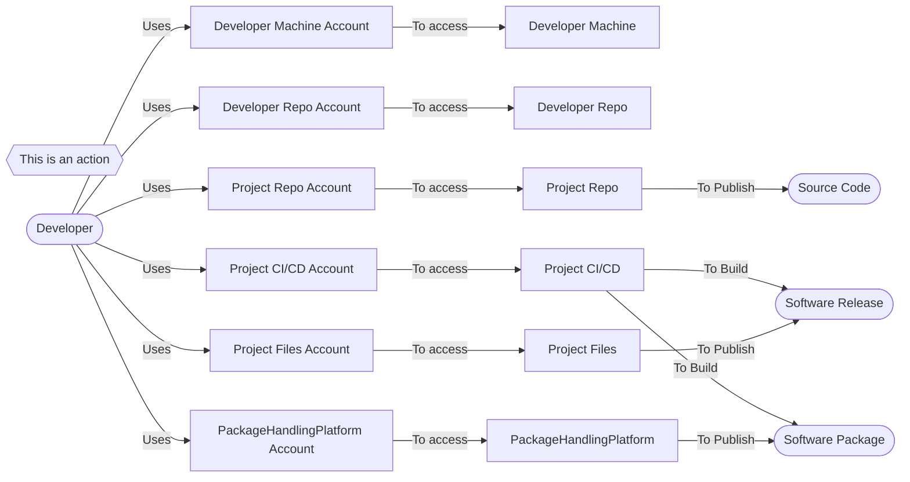

```mermaid
flowchart LR

  This_is_an_action{{This is an action}}
  
  %% People and outcomes
  Developer([Developer]) 
  SourceCode([Source Code])
  SoftwareRelease([Software Release])
  SoftwarePackage([Software Package])

  %% Components
  DevMachine[Developer Machine]
  DevMachineAccount[Developer Machine Account]
  
  DevRepo[Developer Repo]
  DevRepoAccount[Developer Repo Account]
  
  ProjectRepo[Project Repo]
  ProjectRepoAccount[Project Repo Account]
  
  ProjectCICD[Project CI/CD]
  ProjectCICDAccount[Project CI/CD Account]
  
  ProjectFiles[Project Files]
  ProjectFilesAccount[Project Files Account]
  
  PackageHandlingPlatform[PackageHandlingPlatform]
  PackageHandlingPlatformAccount[PackageHandlingPlatform Account]
  
  %% Landscape
  
  Developer-- Uses -->DevMachineAccount-- To access -->DevMachine
  Developer-- Uses -->DevRepoAccount-- To access -->DevRepo
  Developer-- Uses -->ProjectRepoAccount-- To access -->ProjectRepo-- To Publish -->SourceCode
  Developer-- Uses -->ProjectCICDAccount-- To access -->ProjectCICD-- To Build -->SoftwareRelease & SoftwarePackage
  Developer-- Uses -->ProjectFilesAccount-- To access -->ProjectFiles-- To Publish -->SoftwareRelease
  Developer-- Uses -->PackageHandlingPlatformAccount-- To access -->PackageHandlingPlatform-- To Publish -->SoftwarePackage
  
  
```
